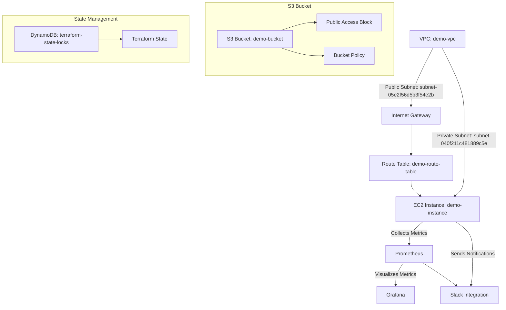
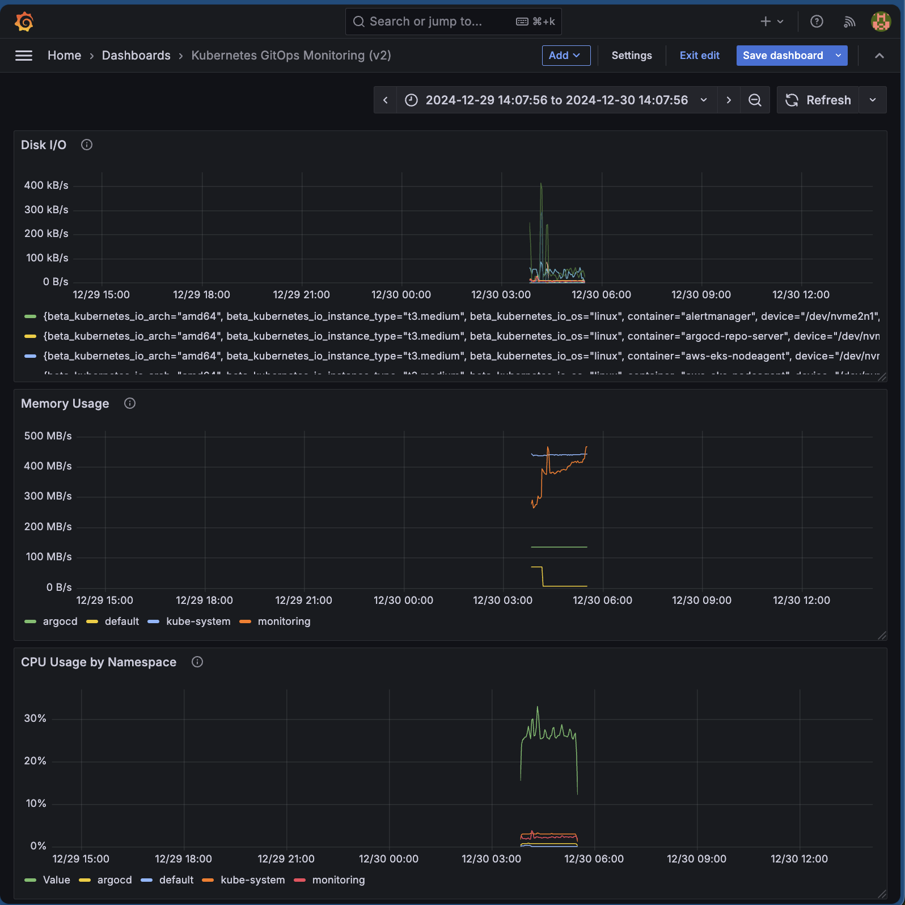

# Kubernetes GitOps Demo

This repository demonstrates a practical implementation of GitOps principles for managing cloud-native infrastructure and applications. It uses Terraform for infrastructure provisioning, Kubernetes for orchestration, and integrates monitoring and automation tools for a robust and scalable deployment workflow.

---

## Features

- **Infrastructure as Code (IaC):** Automate and manage cloud infrastructure using Terraform.
- **Kubernetes Orchestration:** Deploy and manage containerized applications with Kubernetes manifests.
- **GitOps Workflow:** Automate Kubernetes cluster synchronization with Git repository changes using ArgoCD.
- **Monitoring and Alerts:** Leverage Prometheus and Grafana for observability with real-time Slack notifications.
- **Networking:** Configured public and private subnets to isolate resources.

---

## Architecture Diagram



---

## Repository Structure

```plaintext
/terraform                # Terraform configurations for cloud resources
/kubernetes               # Kubernetes manifests for application deployment
/monitoring               # Prometheus and Grafana setup
/slack-integration        # Slack webhook configurations
/docs                     # Project-related documentation
.gitignore                # Ignore files for version control
README.md                 # Project overview and instructions
```

---

## Prerequisites

- Terraform v1.5+
- kubectl configured for your Kubernetes cluster
- AWS CLI with credentials
- Helm for managing Kubernetes applications

---

## Setup Instructions

### 1. Clone the Repository

```bash
git clone https://github.com/your-repo/kubernetes-gitops-demo.git
cd kubernetes-gitops-demo
```

---

### 2. Provision Infrastructure with Terraform

1. Navigate to the Terraform directory:

   ```bash
   cd terraform
   ```

2. Initialize Terraform:

   ```bash
   terraform init
   ```

3. Plan and apply changes:

   ```bash
   terraform plan -out=tfplan.out
   terraform apply "tfplan.out"
   ```

---

### 3. Deploy Kubernetes Applications

1. Navigate to the Kubernetes directory:

   ```bash
   cd ../kubernetes
   ```

2. Apply the manifests:

   ```bash
   kubectl apply -f .
   ```

---

### 4. Set Up Monitoring

1. Navigate to the Monitoring directory:

   ```bash
   cd ../monitoring
   ```

2. Apply monitoring resources:

   ```bash
   kubectl apply -f .
   ```

3. Configure Prometheus as a data source in Grafana:

   - URL: `http://prometheus-server.monitoring.svc.cluster.local:80`
   - Use the following queries for dashboards:
     - **CPU Usage:** `sum(rate(container_cpu_usage_seconds_total[5m])) by (namespace)`
     - **Memory Usage:** `sum(container_memory_usage_bytes) by (namespace)`
     - **Disk I/O:** `rate(container_fs_reads_bytes_total[5m]) + rate(container_fs_writes_bytes_total[5m])`

4. Save the Grafana dashboard as **Kubernetes GitOps Monitoring**.

---

### 5. Automate with GitOps Using ArgoCD

1. Install ArgoCD:

   ```bash
   kubectl apply -n argocd -f https://raw.githubusercontent.com/argoproj/argo-cd/stable/manifests/install.yaml
   ```

2. Access the ArgoCD UI:

   - Port-forward the ArgoCD server:

     ```bash
     kubectl port-forward svc/argocd-server -n argocd 8080:443
     ```

   - Visit: `https://localhost:8080`.

3. Sync ArgoCD with this repository to automate deployments.

---

## Monitoring

- **Prometheus:** Collects metrics from Kubernetes and applications.
- **Grafana:** Displays customizable dashboards for metrics visualization.
- **Alerts:** Configure thresholds for CPU, memory, and disk I/O usage to send alerts via Slack.

### Grafana Dashboard Example

Below is a screenshot of the Grafana dashboard set up for monitoring Kubernetes GitOps:



---

## Slack Integration

1. Add your Slack webhook URL to the `slack-integration/` directory.
2. Configure alerts in Prometheus to trigger Slack notifications for critical events.

---

## Known Issues

1. **S3 Bucket Name Conflict**:

   - **Problem:** Terraform may fail with a `BucketAlreadyExists` error if the S3 bucket name is not unique.
   - **Solution:** Use a globally unique name for the bucket in `main.tf`.

2. **ArgoCD Sync Issues**:

   - **Problem:** ArgoCD fails to sync due to improperly formatted Kubernetes manifests.
   - **Solution:** Validate manifests with `kubectl apply -f <file>` locally before committing.

3. **IAM Role Permission Errors**:
   - **Problem:** Insufficient permissions for Terraform to create AWS resources.
   - **Solution:** Ensure your AWS credentials have admin-level permissions or required policies.

---

## Contributions

Contributions are welcome. Fork this repository, make updates, and submit a pull request.

---

## License

Licensed under the MIT License. See `LICENSE` for details.

---
