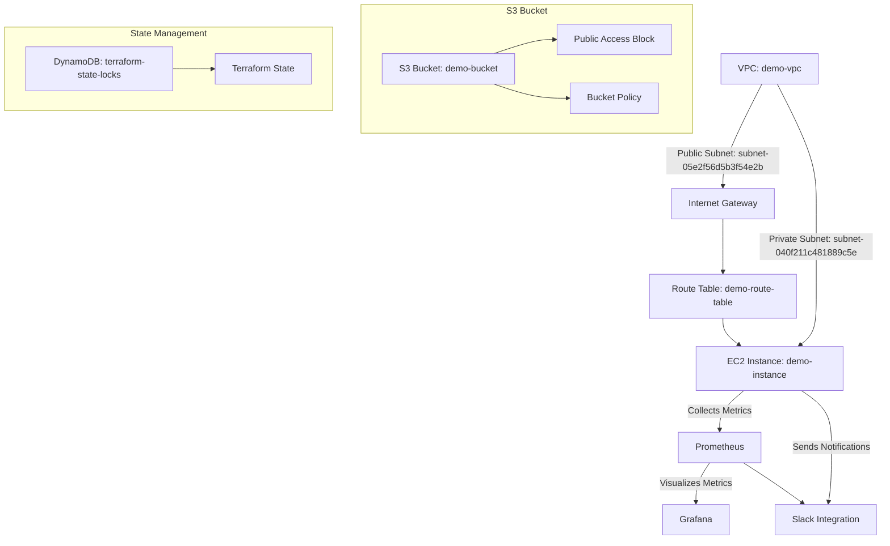

# Architecture Overview

This project uses the following resources:

- **VPC** Isolated network for resources.
- **Subnets:** Separate public and private traffic.
- **Internet Gateway:** Enables internet access for public subnets.
- **Route Tables:** Directs traffic between resources.
- **Public IPs:** Unique addresses for internet access.
- **Security Groups:** Controls access to resources.
- **EC2 Instance:** Hosts applications and services.

## Understanding AWS Infrastructure Through Analogies

1. **VPC (Virtual Private Cloud):**

   - **What it Does:** Provides an isolated network environment for resources.
   - **Analogy:** Think of a VPC as a "virtual neighborhood" where your resources live.

2. **Subnets:**

   - **What it Does:** Divide the VPC into smaller sections for managing public and private traffic.
   - **Analogy:** Subnets are the "streets" in your neighborhood. Public streets allow visitors, while private streets are restricted.

3. **Internet Gateway:**

   - **What it Does:** Connects the public subnets to the internet.
   - **Analogy:** The "front gate" of your neighborhood that allows traffic in and out.

4. **Route Tables:**

   - **What it Does:** Define how traffic moves between resources.
   - **Analogy:** Like a "GPS map" that directs traffic to the correct destination (e.g., the Internet Gateway for external traffic).

5. **Public IPs:**

   - **What it Does:** Assigns a unique address to EC2 instances for internet access.
   - **Analogy:** Think of a public IP as a "mailing address" for your house, enabling direct communication with others.

6. **Security Groups:**

   - **What it Does:** Control which traffic is allowed to reach your resources.
   - **Analogy:** Security Groups are the "security guards" for your house, letting only approved visitors enter.

7. **EC2 Instance:**
   - **What it Does:** A virtual server running applications or services.
   - **Analogy:** The "house" where your workloads live and operate.

---

## Why this setup?

- **VPC** isolates and secures resources.
- **Subnet and Public IP** enable controlled internet access.
- **Route Tables and Internet Gateway** ensure correct traffic flow.
- **Security Groups** protect resources from unauthorized access.

---

## **Architecture Diagram**

---
