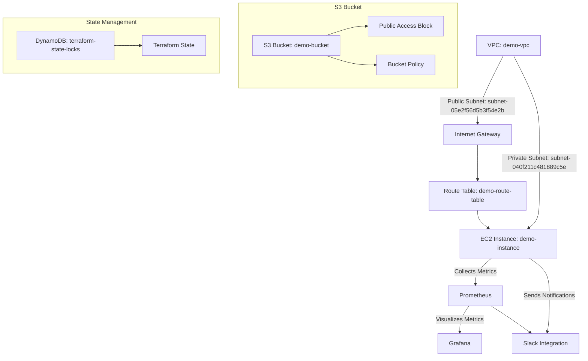

# Architecture Overview

This document explains the resources and connections configured in this project.

## **Resources Used**

1. **VPC (Virtual Private Cloud):**

   - **What it Does:** Provides an isolated network environment for resources.
   - **Analogy:** Think of a VPC as a "virtual neighborhood" where your resources live.

2. **Subnets:**

   - **What it Does:** Divide the VPC into smaller sections for managing public and private traffic.
   - **Analogy:** Subnets are the "streets" in your neighborhood. Public streets allow visitors, while private streets are restricted.

3. **Internet Gateway:**

   - **What it Does:** Connects the public subnets to the internet.
   - **Analogy:** The "front gate" of your neighborhood that allows traffic in and out.

4. **Route Tables:**

   - **What it Does:** Define how traffic moves between resources.
   - **Analogy:** Like a "GPS map" that directs traffic to the correct destination (e.g., the Internet Gateway for external traffic).

5. **Public IPs:**

   - **What it Does:** Assigns a unique address to EC2 instances for internet access.
   - **Analogy:** Think of a public IP as a "mailing address" for your house, enabling direct communication with others.

6. **Security Groups:**

   - **What it Does:** Control which traffic is allowed to reach your resources.
   - **Analogy:** Security Groups are the "security guards" for your house, letting only approved visitors enter.

7. **EC2 Instance:**
   - **What it Does:** A virtual server running applications or services.
   - **Analogy:** The "house" where your workloads live and operate.

---

## **Networking Analogies**

This section simplifies technical concepts with relatable analogies:

1. **VPC** → "Neighborhood"
2. **Subnets** → "Streets"
3. **Internet Gateway** → "Front Gate"
4. **Route Tables** → "GPS Map"
5. **Public IPs** → "Mailing Address"
6. **Security Groups** → "Security Guards"
7. **EC2 Instance** → "House"

---

## **Public IP Configuration**

### **What Happened?**

1. **Subnet Updated**:

   - Subnet `subnet-05e2f56d5b3f54e2b` was modified to auto-assign public IPs.
   - Terraform recreated the EC2 instance (`example`) to apply this change.

2. **Outcome**:
   - The EC2 instance now has:
     - **Public IP:** `54.188.222.157`
     - **Public DNS:** `ec2-54-188-222-157.us-west-2.compute.amazonaws.com`

---

## **Why This Setup is Useful**

- **VPC** isolates and secures resources.
- **Subnet and Public IP** enable controlled internet access.
- **Route Tables and Internet Gateway** ensure correct traffic flow.
- **Security Groups** protect resources from unauthorized access.

---

## **Architecture Diagram**

---
